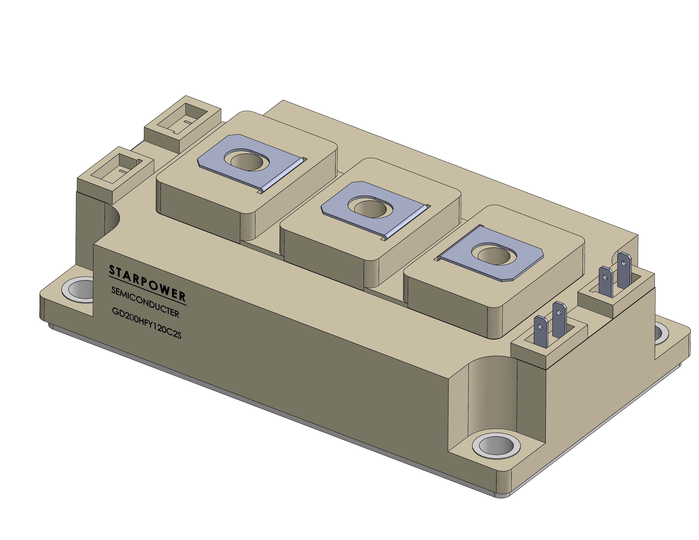

<h1 align="center">🔋 Power Electronics Components Portfolio</h1>

     

---
## Introduction
As an experienced Electrical-Electronics Engineer, I combine my technical domain knowledge with strong SolidWorks skills. I focus on creating accurate 3D representations of power electronics components by strictly adhering to manufacturer datasheets, bridging the gap between electrical specifications and mechanical design.

## What this repo contains?
This repository features a collection of high-precision 3D CAD models designed in SolidWorks. Each model is engineered from scratch based on official manufacturer datasheets to serve as reliable assets for power electronics simulation and mechanical integration projects.

---

### Battery Models
| Component | Model / Part No | Datasheet |
| :--- | :--- | :--- |
| **Lead-Acid Battery** | DESA 12V 9Ah | [View Manufacturer Datasheet](https://www.desabattery.com/akupdf/31045255092866926256DS12-9(12V-9AH).pdf) |

#### Lead Acid Battery - 12V 9Ah - DESA Battery

  

---

### Capacitor Models
| Component | Model / Part No | Datasheet |
| :--- | :--- | :--- |
| **AC Capacitor** | AKMJYD-RC-100uF-420VAC | [View Manufacturer Datasheet](http://www.rongtechelectronics.com/pd.jsp?id=65) |

#### AC Capacitor - 100uF 420VAC - Rongtech - AKMJYD-RC-100uF-420VAC

  

---

### Inductor Models
| Component | Model / Part No | Datasheet |
| :--- | :--- | :--- |
| **Choke Coil** | Example-Type-1 | --- |
| **Choke Coil** | Example-Type-2 | --- |

#### Choke Coil - Example - Type-1

  

#### Choke Coil - Example - Type-2

  

---

### Heatsink Models
| Component | Model / Part No | Datasheet |
| :--- | :--- | :--- |
| **Heatsink** | 265AS 80X160MM | [View Manufacturer Datasheet](https://arma.com/tr/urun/265-as-aluminyum-sogutucu) |

#### Heatsink - 80x160MM

  

---

### IGBT Models
| Component | Model / Part No | Datasheet |
| :--- | :--- | :--- |
| **FUJI** | 2MBI450VE-120-50 | [View Manufacturer Datasheet](https://products.fujielectric.com/en/semiconductor/detail/2MBI450VE-120-50/) |
| **STARPOWER** | GD200HFY120C2S | [View Manufacturer Datasheet](https://www.starpowereurope.com/media/417159/GD200HFY120C2S.PDF) |

#### IGBT Module - Fuji - 2MBI450VE-120-50

  

 

#### IGBT Module - Starpower - GD200HFY120C2S

  
  

---

### SCR Models
| Component | Model / Part No | Datasheet |
| :--- | :--- | :--- |
| **IXYS** | MCMA260PD1600YB | [View Manufacturer Datasheet](https://www.littelfuse.com/products/power-semiconductors-control-ics/power-modules/thyristor-diode-modules/thyristor-diode/mcma260pd1600yb) |
| **IXYS** | MCC310-16io1 | [View Manufacturer Datasheet](https://www.littelfuse.com/assetdocs/littelfuse-power-semiconductors-mcc310-16io1-datasheet?assetguid=73994303-cbbf-499a-9ae1-f6c735a2e3c5) |
| **Powersem** | PSKT332M | [View Manufacturer Datasheet](https://powersem.net/HiPOR/THY-THY/PSKT332M.pdf) |

#### SCR Module - IXYS - MCMA260PD1600YB

  
  

#### SCR Module - IXYS - MCC310-16io1

  
  

#### SCR Module - Powersem - PSKT332M

  
  

---

### Screw Models
| Component | Model / Part No | Datasheet |
| :--- | :--- | :--- |
| **Welding Screw** | M5x10 | --- |

#### Welding Screw

  

---
## Licenses
 
All **Images & Presentations** inside this portfolio are licensed under a <a rel="license" href="http://creativecommons.org/licenses/by-sa/4.0/">Creative Commons Attribution-ShareAlike 4.0 International License</a>.

  

## Credits
All credits, references, and used standard components are listed within the project descriptions respectively.
